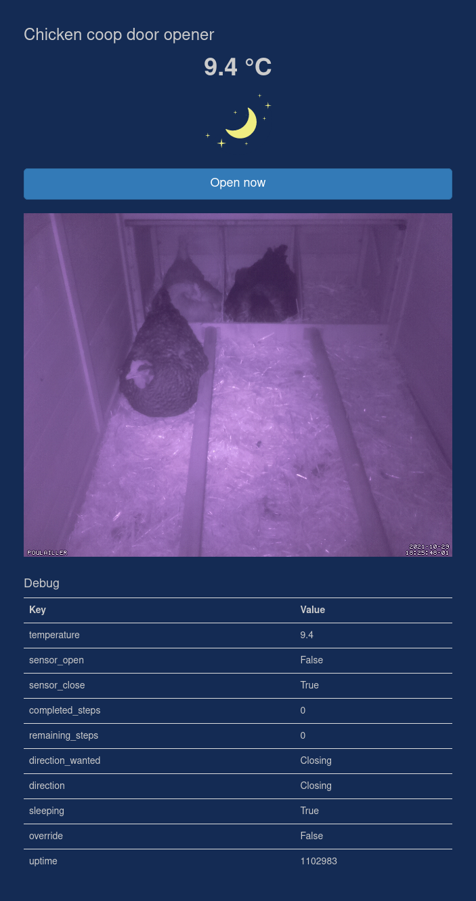

# Automatic Chicken Coop Door Opener

Here is my personal implementation of an Automatic Chicken Coop Door Opener. It has direct control button, a simple web interface with camera support and can be controlled via `MQTT` protocol. It is integrated in my home automation system.

This project requires materials:
- 3D printed parts
- An `Arduino` (duemilanove in my case, but any board should be okay)
- A `Raspberry` Pi (3 A+ in my case)
- `Raspberry Pi Camera` + `SV-6B` Infrared Ring (optional)
- A Stepper motor (project could be adapted to support DC motors)
- A Stepper driver (`DRV8825` in my case)
- A [Push Button Switch Box](https://www.aliexpress.com/item/4000121428780.html)
- A [box](https://www.aliexpress.com/item/33003227855.html) to protect electronics
- A `DS18b20` Temperature sensor
- Two [magnetic door sensor](https://www.amazon.fr/gp/product/B082PM18V6/) (I've choose mine brown)
- Some 4 wires cables, dupont cables and [Solder Seal Wire Connectors](https://www.aliexpress.com/item/1005002662810874.html)
- A [Waterproof Electrical Distribution Box](https://www.aliexpress.com/item/4001061820250.html)
- `5V` and `12V` [Industrial DIN Rail Switching Power Supply](https://www.aliexpress.com/item/4001289041252.html)
- 13cm diameter 8 steel rod
- Two `608` bearings
- Some washers and screws

# Raspberry Pi software installation

- First install your preferred Linux distribution (I've simply used Raspberry Pi
 OS).
- (optional) Install `motion`: `sudo apt install motion` (my config file in the `other` directory) and make it start at boot (edit `/etc/default/motion`)
- Install `redis`: `sudo apt install redis` and enable start on boot `sudo systemctl enable redis`
- Clone this project GIT repository
- Install python required libraries: `sudo pip3 install -r requirements.txt`
- Install `gunicorn3` and `authbind`: `sudo apt install gunicorn3 authbind`
- Configure `authbind`: `sudo touch /etc/authbind/byport/80; sudo chmod 500 /etc/authbind/byport/80; sudo chown pi /etc/authbind/byport/80`
- Copy file `other/chicken-coop.service` to `/etc/systemd/system/chicken-coop.service`, then reload systemd (`sudo systemctl daemon-reload`) and enable the service `sudo systemctl enable chicken-coop.service`




# Electronic assembly

Please refer to the schema below to connect elements. Also **connect the Arduino to the Raspberry Pi via USB**, this is needed as they are communicating internally.


## Arduino firmware upload

You'll find the arduino firmware in the `other/chicken_coop_arduino_v2` folder. You'll need to install libraries `ArduinoJson` and `StepperDriver`.

# Print 3D parts

Print files from folder `other/3D-parts`:
- `box.stl`
- `lead.stl`
- `drive-gear.stl`
- `stepper-gear.stl`
- `winder.stl`
- `IR-holder.stl`
- `IR-holder-base.stl`
- `case-without-clip.stl` (use some glue to paste it on `IR-holder.stl`)


# Node-RED

I use [Node-RED](https://nodered.org/) to automate opening/closing the door according to the sun position.


```
[{"id":"c7d25223.e79a98","type":"tab","label":"Chicken coop","disabled":false,"info":""},{"id":"a1a07d72.5bd8","type":"inject","z":"c7d25223.e79a98","name":"MANUAL OPEN","props":[{"p":"payload"},{"p":"topic","vt":"str"}],"repeat":"","crontab":"","once":false,"onceDelay":0.1,"topic":"","payload":"","payloadType":"str","x":420,"y":520,"wires":[["666bfd51.be461c"]]},{"id":"5502c773.69c1b8","type":"inject","z":"c7d25223.e79a98","name":"MANUAL CLOSE","props":[{"p":"payload"},{"p":"topic","vt":"str"}],"repeat":"","crontab":"","once":false,"onceDelay":0.1,"topic":"","payload":"","payloadType":"str","x":420,"y":580,"wires":[["a247530a.950348"]]},{"id":"666bfd51.be461c","type":"change","z":"c7d25223.e79a98","name":"OPEN","rules":[{"t":"set","p":"payload","pt":"msg","to":"OPEN","tot":"str"}],"action":"","property":"","from":"","to":"","reg":false,"x":730,"y":660,"wires":[["fbf06eec.9e5c6"]]},{"id":"a247530a.950348","type":"change","z":"c7d25223.e79a98","name":"CLOSE","rules":[{"t":"set","p":"payload","pt":"msg","to":"CLOSE","tot":"str"}],"action":"","property":"","from":"","to":"","reg":false,"x":740,"y":700,"wires":[["fbf06eec.9e5c6"]]},{"id":"e3c982f5.460ba","type":"change","z":"c7d25223.e79a98","name":"topic Chicken coop","rules":[{"t":"set","p":"topic","pt":"msg","to":"chicken-coop/cmnd/ACTION","tot":"str"}],"action":"","property":"","from":"","to":"","reg":false,"x":1290,"y":680,"wires":[["5edadbf0.16693c","c711ead2.5034b8"]]},{"id":"c711ead2.5034b8","type":"debug","z":"c7d25223.e79a98","name":"","active":false,"tosidebar":true,"console":false,"tostatus":false,"complete":"false","x":1490,"y":620,"wires":[]},{"id":"5edadbf0.16693c","type":"mqtt out","z":"c7d25223.e79a98","name":"CHICKEN COOP","topic":"","qos":"","retain":"","broker":"499038ea.d2406","x":1510,"y":680,"wires":[]},{"id":"6a6f2f23.bda448","type":"mqtt in","z":"c7d25223.e79a98","name":"","topic":"chicken-coop/tele/STATE","qos":"2","datatype":"auto","broker":"499038ea.d2406","x":430,"y":1160,"wires":[["b574a3b.f240fe"]]},{"id":"b574a3b.f240fe","type":"debug","z":"c7d25223.e79a98","name":"","active":false,"tosidebar":true,"console":false,"tostatus":false,"complete":"false","x":670,"y":1160,"wires":[]},{"id":"470b9cb6.7c8c3c","type":"sun-position","z":"c7d25223.e79a98","name":"","positionConfig":"9a8aa319.57d4a8","rules":[],"onlyOnChange":"true","topic":"","outputs":1,"start":"civilDawn","startType":"pdsTime","startOffset":0,"startOffsetType":"none","startOffsetMultiplier":60000,"end":"civilDusk","endType":"pdsTime","endOffset":"","endOffsetType":"none","endOffsetMultiplier":"3600000","x":390,"y":700,"wires":[["97193675.7260f8"]]},{"id":"4abdc73f.09fec8","type":"inject","z":"c7d25223.e79a98","name":"Pulsar","props":[{"p":"payload"},{"p":"topic","vt":"str"}],"repeat":"60","crontab":"","once":true,"onceDelay":0.1,"topic":"","payload":"","payloadType":"date","x":220,"y":700,"wires":[["470b9cb6.7c8c3c"]]},{"id":"97193675.7260f8","type":"switch","z":"c7d25223.e79a98","name":"","property":"payload.sunInSky","propertyType":"msg","rules":[{"t":"true"},{"t":"false"}],"checkall":"true","repair":false,"outputs":2,"x":570,"y":700,"wires":[["666bfd51.be461c"],["a247530a.950348"]]},{"id":"4dd9039d.c1e154","type":"mqtt in","z":"c7d25223.e79a98","name":"","topic":"chicken-coop/tele/OVERRIDE","qos":"2","datatype":"auto","broker":"499038ea.d2406","x":440,"y":940,"wires":[["5fbb85e.d93fe7c"]]},{"id":"c0edb4c.8d3f4c8","type":"debug","z":"c7d25223.e79a98","name":"","active":false,"tosidebar":true,"console":false,"tostatus":false,"complete":"false","statusVal":"","statusType":"auto","x":1430,"y":840,"wires":[]},{"id":"e409127f.754b7","type":"inject","z":"c7d25223.e79a98","name":"on start","props":[{"p":"payload"},{"p":"topic","vt":"str"}],"repeat":"","crontab":"","once":true,"onceDelay":0.1,"topic":"","payload":"","payloadType":"date","x":170,"y":100,"wires":[["7721df67.c207a8"]]},{"id":"7721df67.c207a8","type":"function","z":"c7d25223.e79a98","name":"init devices","func":"/* set up all devices */\n\nvar devices = {\n    door: {\n        name: 'Chicken door',\n        default: 'auto',\n        force: false,\n    },\n}\n\nglobal.set('devices', devices);\n\nreturn msg;\n","outputs":1,"noerr":0,"initialize":"","finalize":"","x":360,"y":100,"wires":[["922ad91d.2f17c8"]]},{"id":"922ad91d.2f17c8","type":"function","z":"c7d25223.e79a98","name":"","func":"var state   = global.get('state')   || {};\nvar devices = global.get('devices') || {};\n\n\nfor (var device in devices) {\n\n    if ( ! (device in state) ) {\n        state[device] = {}\n        state[device]['input'] = devices[device]['default'];\n    } \n    \n\n    if (devices[device]['force'] === true) {\n        state[device]['input'] = devices[device]['default'];\n    }   \n\n    payload = state[device]['input'];\n\n    node.send({\n        topic: 'terrarium/input/' + device,\n        payload: payload\n    });\n}\n\n\nglobal.set('state', state);\n","outputs":1,"noerr":0,"initialize":"","finalize":"","x":590,"y":100,"wires":[["7518b714.2837c8"]]},{"id":"7518b714.2837c8","type":"delay","z":"c7d25223.e79a98","name":"","pauseType":"delay","timeout":"1","timeoutUnits":"seconds","rate":"1","nbRateUnits":"1","rateUnits":"second","randomFirst":"1","randomLast":"5","randomUnits":"seconds","drop":false,"x":760,"y":100,"wires":[["2598e395.26b73c","e682e811.c8b8f8"]]},{"id":"2598e395.26b73c","type":"mqtt out","z":"c7d25223.e79a98","name":"TEST","topic":"","qos":"","retain":"","broker":"499038ea.d2406","x":930,"y":100,"wires":[]},{"id":"e682e811.c8b8f8","type":"debug","z":"c7d25223.e79a98","name":"","active":true,"tosidebar":true,"console":false,"tostatus":false,"complete":"false","statusVal":"","statusType":"auto","x":960,"y":160,"wires":[]},{"id":"5fbb85e.d93fe7c","type":"function","z":"c7d25223.e79a98","name":"store override","func":"\n/* store state back into state machine */\nglobal.set('state.chicken-coop.override', msg.payload);\n\nreturn msg;","outputs":1,"noerr":0,"initialize":"","finalize":"","x":800,"y":940,"wires":[["d9b4a67a.acd348"]]},{"id":"fbf06eec.9e5c6","type":"function","z":"c7d25223.e79a98","name":"Respect override","func":"var override = global.get('state.chicken-coop.override');\n\nif (override==true) {\n    msg.payload=null;\n}\n\nreturn msg;","outputs":1,"noerr":0,"initialize":"","finalize":"","x":910,"y":680,"wires":[["12f6be88.27a2f9"]]},{"id":"d9b4a67a.acd348","type":"switch","z":"c7d25223.e79a98","name":"","property":"payload","propertyType":"msg","rules":[{"t":"true"}],"checkall":"true","repair":false,"outputs":1,"x":950,"y":940,"wires":[["3ac436d.57ae84a"]]},{"id":"cf3c943.9f75ee8","type":"delay","z":"c7d25223.e79a98","name":"","pauseType":"delay","timeout":"1","timeoutUnits":"hours","rate":"1","nbRateUnits":"1","rateUnits":"second","randomFirst":"1","randomLast":"5","randomUnits":"seconds","drop":false,"x":1260,"y":940,"wires":[["104d8435.acb36c","f03327b8.42df"]]},{"id":"3ac436d.57ae84a","type":"change","z":"c7d25223.e79a98","name":"Disable override","rules":[{"t":"set","p":"payload","pt":"msg","to":"false","tot":"bool"}],"action":"","property":"","from":"","to":"","reg":false,"x":1100,"y":940,"wires":[["cf3c943.9f75ee8"]]},{"id":"104d8435.acb36c","type":"debug","z":"c7d25223.e79a98","name":"","active":false,"tosidebar":true,"console":false,"tostatus":false,"complete":"false","x":1430,"y":980,"wires":[]},{"id":"12f6be88.27a2f9","type":"switch","z":"c7d25223.e79a98","name":"Check override","property":"payload","propertyType":"msg","rules":[{"t":"nnull"}],"checkall":"true","repair":false,"outputs":1,"x":1100,"y":680,"wires":[["e3c982f5.460ba"]]},{"id":"f03327b8.42df","type":"mqtt out","z":"c7d25223.e79a98","name":"Remove override","topic":"chicken-coop/tele/OVERRIDE","qos":"","retain":"","broker":"499038ea.d2406","x":1450,"y":900,"wires":[]},{"id":"546f0d20.38d7e4","type":"inject","z":"c7d25223.e79a98","name":"Disable override","props":[{"p":"payload"},{"p":"topic","vt":"str"}],"repeat":"","crontab":"","once":false,"onceDelay":0.1,"topic":"","payload":"false","payloadType":"bool","x":420,"y":880,"wires":[["11728710.529509"]]},{"id":"11728710.529509","type":"function","z":"c7d25223.e79a98","name":"store override","func":"\n/* store state back into state machine */\nglobal.set('state.chicken-coop.override', msg.payload);\n\nreturn msg;","outputs":1,"noerr":0,"initialize":"","finalize":"","x":800,"y":880,"wires":[["f03327b8.42df","c0edb4c.8d3f4c8"]]},{"id":"60c97cb0.cab624","type":"comment","z":"c7d25223.e79a98","name":"React to sun position","info":"","x":250,"y":620,"wires":[]},{"id":"58597c67.21380c","type":"comment","z":"c7d25223.e79a98","name":"Manage override","info":"","x":220,"y":840,"wires":[]},{"id":"14b453f.d74912c","type":"comment","z":"c7d25223.e79a98","name":"Debug","info":"","x":220,"y":1120,"wires":[]},{"id":"499038ea.d2406","type":"mqtt-broker","name":"MQTT - NAS","broker":"nas.house.kumy.net","port":"1883","clientid":"","usetls":false,"compatmode":false,"keepalive":"60","cleansession":true,"birthTopic":"","birthQos":"0","birthPayload":"","closeTopic":"","closeQos":"0","closePayload":"","willTopic":"","willQos":"0","willPayload":""},{"id":"9a8aa319.57d4a8","type":"position-config","name":"House","isValide":"true","longitude":"0","latitude":"0","angleType":"deg","timeZoneOffset":99,"timeZoneDST":0,"stateTimeFormat":"3","stateDateFormat":"12"}]
```

# License

This project is released under [GNU GPLv3](LICENSE) license.

# Credits

- The chicken egg is from [Icon Fonts](https://www.onlinewebfonts.com/icon/552882) and is licensed by CC BY 3.0
- The day night original svg is from [Free SVG](https://freesvg.org/day-and-night) and is licensed as Public Domain
- The electronic schematic image was generated using a self build [Fritzing](https://fritzing.org/) install.
- The Pi Camera mount with infrared ring is a derivative of [Thing ico
Simple PiCam Case/Mount](https://www.thingiverse.com/thing:2613031), [Infrared Ring Mount SV-6B](https://www.thingiverse.com/thing:643221) and [GoPro customizable mounts, and a library to expand](https://www.thingiverse.com/thing:62800)
