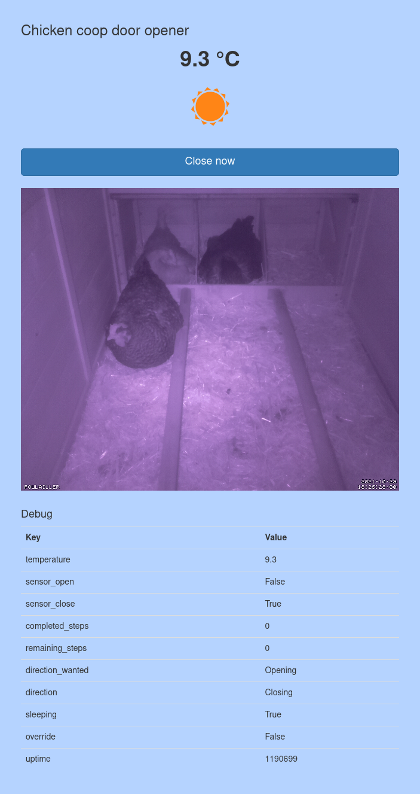
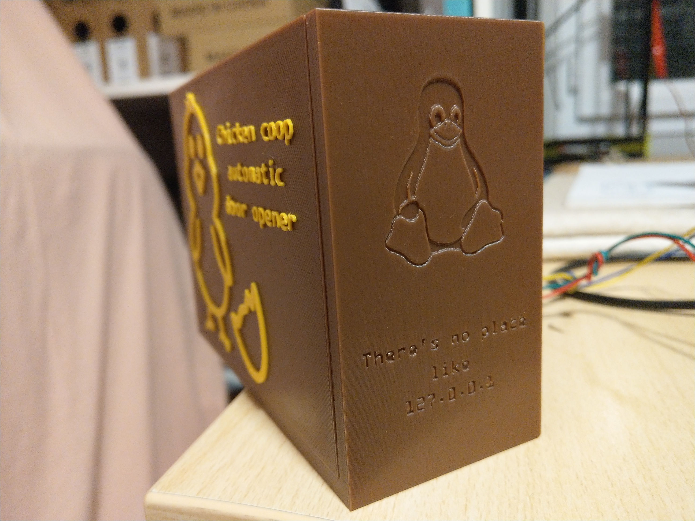

# Automatic Chicken Coop Door Opener

Here is my personal implementation of an Automatic Chicken Coop Door Opener. It has direct control button, a simple web interface with camera support and can be controlled via `MQTT` protocol. It is integrated in my home automation system.

This project requires materials:
- 3D printed parts
- An `Arduino` (duemilanove in my case, but any board should be okay)
- A `Raspberry` Pi (3 A+ in my case)
- `Raspberry Pi Camera` + `SV-6B` Infrared Ring (optional)
- A Stepper motor (project could be adapted to support DC motors)
- A Stepper driver (`DRV8825` in my case)
- A [Push Button Switch Box](https://www.aliexpress.com/item/4000121428780.html)
- A [box](https://www.aliexpress.com/item/33003227855.html) to protect electronics
- A `DS18b20` Temperature sensor
- Two [magnetic door sensor](https://www.amazon.fr/gp/product/B082PM18V6/) (I've choose mine brown)
- Some 4 wires cables, dupont cables and [Solder Seal Wire Connectors](https://www.aliexpress.com/item/1005002662810874.html)
- A [Waterproof Electrical Distribution Box](https://www.aliexpress.com/item/4001061820250.html)
- `5V` and `12V` [Industrial DIN Rail Switching Power Supply](https://www.aliexpress.com/item/4001289041252.html)
- 13cm diameter 8 steel rod
- Two `608` bearings
- Some washers and screws

# Raspberry Pi software installation

- First install your preferred Linux distribution (I've simply used Raspberry Pi
 OS).
- (optional) Install `motion`: `sudo apt install motion` (my config file in the `other` directory) and make it start at boot (edit `/etc/default/motion`)
- Install `redis server`: `sudo apt install redis-server` and enable start on boot `sudo systemctl enable redis-server`
- Clone this project GIT repository
- Install python required libraries: `sudo pip3 install -r requirements.txt`
- Install `gunicorn3` and `authbind`: `sudo apt install gunicorn3 authbind`
- Configure `authbind`: `sudo touch /etc/authbind/byport/80; sudo chmod 500 /etc/authbind/byport/80; sudo chown pi /etc/authbind/byport/80`
- Copy file `other/chicken-coop.service` to `/etc/systemd/system/chicken-coop.service`, then reload systemd (`sudo systemctl daemon-reload`) and enable the service `sudo systemctl enable chicken-coop.service`




# Electronic assembly

Please refer to the schema below to connect elements. Also **connect the Arduino to the Raspberry Pi via USB**, this is needed as they are communicating internally.


## Arduino firmware upload

You'll find the arduino firmware in the `other/chicken_coop_arduino_v2` folder. You'll need to install libraries `ArduinoJson` and `StepperDriver`.

# Print 3D parts

Print files from folder `other/3D-parts`:
- `box.stl`
- `lead.stl`
- `drive-gear.stl`
- `stepper-gear.stl`
- `winder.stl`
- `IR-holder.stl`
- `IR-holder-base.stl`
- `case-without-clip.stl` (use some glue to paste it on `IR-holder.stl`)





# Node-RED

I use [Node-RED](https://nodered.org/) to automate opening/closing the door according to the sun position.


```
[{"id":"c7d25223.e79a98","type":"tab","label":"Chicken coop","disabled":false,"info":""},{"id":"a1a07d72.5bd8","type":"inject","z":"c7d25223.e79a98","name":"MANUAL OPEN","props":[{"p":"payload"}],"repeat":"","crontab":"","once":false,"onceDelay":0.1,"topic":"","payload":"True","payloadType":"str","x":640,"y":100,"wires":[["fd09d4f.2c761a8","c0e33773.e7af7"]]},{"id":"5502c773.69c1b8","type":"inject","z":"c7d25223.e79a98","name":"MANUAL CLOSE","props":[{"p":"payload"}],"repeat":"","crontab":"","once":false,"onceDelay":0.1,"topic":"","payload":"True","payloadType":"str","x":640,"y":140,"wires":[["fd09d4f.2c761a8","2bb7edef.acf7e2"]]},{"id":"666bfd51.be461c","type":"change","z":"c7d25223.e79a98","name":"OPEN","rules":[{"t":"set","p":"payload","pt":"msg","to":"OPEN","tot":"str"}],"action":"","property":"","from":"","to":"","reg":false,"x":810,"y":280,"wires":[["63d5a226.1bf514"]]},{"id":"a247530a.950348","type":"change","z":"c7d25223.e79a98","name":"CLOSE","rules":[{"t":"set","p":"payload","pt":"msg","to":"CLOSE","tot":"str"}],"action":"","property":"","from":"","to":"","reg":false,"x":820,"y":340,"wires":[["63d5a226.1bf514"]]},{"id":"c711ead2.5034b8","type":"debug","z":"c7d25223.e79a98","name":"","active":false,"tosidebar":true,"console":false,"tostatus":false,"complete":"false","x":1510,"y":120,"wires":[]},{"id":"5edadbf0.16693c","type":"mqtt out","z":"c7d25223.e79a98","name":"CHICKEN COOP","topic":"chicken-coop/cmnd/ACTION","qos":"","retain":"","broker":"499038ea.d2406","x":1530,"y":260,"wires":[]},{"id":"6a6f2f23.bda448","type":"mqtt in","z":"c7d25223.e79a98","name":"","topic":"chicken-coop/tele/STATE","qos":"2","datatype":"auto","broker":"499038ea.d2406","x":430,"y":760,"wires":[["186cc186.50ee46"]]},{"id":"b574a3b.f240fe","type":"debug","z":"c7d25223.e79a98","name":"","active":false,"tosidebar":true,"console":false,"tostatus":false,"complete":"false","x":1010,"y":760,"wires":[]},{"id":"470b9cb6.7c8c3c","type":"sun-position","z":"c7d25223.e79a98","name":"","positionConfig":"9a8aa319.57d4a8","rules":[],"onlyOnChange":"true","topic":"","outputs":1,"start":"civilDawn","startType":"pdsTime","startOffset":"","startOffsetType":"none","startOffsetMultiplier":60000,"end":"civilDusk","endType":"pdsTime","endOffset":"-40","endOffsetType":"num","endOffsetMultiplier":"60000","x":390,"y":320,"wires":[["745ca347.8275c4","97193675.7260f8"]]},{"id":"4abdc73f.09fec8","type":"inject","z":"c7d25223.e79a98","name":"Pulsar","props":[{"p":"payload"},{"p":"topic","vt":"str"}],"repeat":"60","crontab":"","once":true,"onceDelay":0.1,"topic":"","payload":"","payloadType":"date","x":220,"y":320,"wires":[["470b9cb6.7c8c3c"]]},{"id":"97193675.7260f8","type":"switch","z":"c7d25223.e79a98","name":"sunInSky?","property":"payload.sunInSky","propertyType":"msg","rules":[{"t":"true"},{"t":"false"}],"checkall":"true","repair":false,"outputs":2,"x":630,"y":320,"wires":[["666bfd51.be461c"],["a247530a.950348"]]},{"id":"4dd9039d.c1e154","type":"mqtt in","z":"c7d25223.e79a98","name":"","topic":"chicken-coop/cmnd/OVERRIDE","qos":"2","datatype":"auto","broker":"499038ea.d2406","x":450,"y":600,"wires":[["5fbb85e.d93fe7c","35cb803c.ddd72"]]},{"id":"5fbb85e.d93fe7c","type":"function","z":"c7d25223.e79a98","name":"store override","func":"\n/* store state back into state machine */\nglobal.set('state.chicken-coop.override', msg.payload == \"True\");\n\nreturn msg;","outputs":1,"noerr":0,"initialize":"","finalize":"","x":760,"y":560,"wires":[["d9b4a67a.acd348"]]},{"id":"d9b4a67a.acd348","type":"switch","z":"c7d25223.e79a98","name":"IsOverride?","property":"payload","propertyType":"msg","rules":[{"t":"eq","v":"True","vt":"str"}],"checkall":"true","repair":false,"outputs":1,"x":930,"y":560,"wires":[["3ac436d.57ae84a"]]},{"id":"3ac436d.57ae84a","type":"change","z":"c7d25223.e79a98","name":"Disable override","rules":[{"t":"set","p":"payload","pt":"msg","to":"False","tot":"str"}],"action":"","property":"","from":"","to":"","reg":false,"x":1100,"y":560,"wires":[["5a4e03ee.41194c"]]},{"id":"104d8435.acb36c","type":"debug","z":"c7d25223.e79a98","name":"","active":false,"tosidebar":true,"console":false,"tostatus":false,"complete":"false","x":1510,"y":600,"wires":[]},{"id":"f03327b8.42df","type":"mqtt out","z":"c7d25223.e79a98","name":"","topic":"chicken-coop/cmnd/OVERRIDE","qos":"","retain":"","broker":"499038ea.d2406","x":1570,"y":500,"wires":[]},{"id":"546f0d20.38d7e4","type":"inject","z":"c7d25223.e79a98","name":"Disable override","props":[{"p":"payload"}],"repeat":"","crontab":"","once":false,"onceDelay":0.1,"topic":"","payload":"False","payloadType":"str","x":440,"y":480,"wires":[["f03327b8.42df"]]},{"id":"60c97cb0.cab624","type":"comment","z":"c7d25223.e79a98","name":"React to sun position","info":"","x":250,"y":240,"wires":[]},{"id":"58597c67.21380c","type":"comment","z":"c7d25223.e79a98","name":"Manage override","info":"","x":220,"y":460,"wires":[]},{"id":"14b453f.d74912c","type":"comment","z":"c7d25223.e79a98","name":"Debug","info":"","x":170,"y":1100,"wires":[]},{"id":"35cb803c.ddd72","type":"debug","z":"c7d25223.e79a98","name":"","active":false,"tosidebar":true,"console":false,"tostatus":false,"complete":"false","statusVal":"","statusType":"auto","x":750,"y":620,"wires":[]},{"id":"60601a56.7f041c","type":"debug","z":"c7d25223.e79a98","name":"","active":true,"tosidebar":true,"console":false,"tostatus":false,"complete":"false","statusVal":"","statusType":"auto","x":770,"y":1140,"wires":[]},{"id":"3c4749ab.162266","type":"inject","z":"c7d25223.e79a98","name":"Read override","props":[],"repeat":"","crontab":"","once":false,"onceDelay":0.1,"topic":"","x":390,"y":1140,"wires":[["37e30002.79cbb"]]},{"id":"37e30002.79cbb","type":"function","z":"c7d25223.e79a98","name":"isOverridden?","func":"\n/* store state back into state machine */\nmsg.payload = global.get('state.chicken-coop.override');\n\nreturn msg;","outputs":1,"noerr":0,"initialize":"","finalize":"","x":600,"y":1140,"wires":[["60601a56.7f041c"]]},{"id":"54d75f5.38342a","type":"inject","z":"c7d25223.e79a98","name":"Enable override","props":[{"p":"payload"}],"repeat":"","crontab":"","once":false,"onceDelay":0.1,"topic":"","payload":"True","payloadType":"str","x":440,"y":520,"wires":[["f03327b8.42df"]]},{"id":"5a4e03ee.41194c","type":"stoptimer","z":"c7d25223.e79a98","duration":"6","units":"Hour","payloadtype":"num","payloadval":"0","name":"","x":1290,"y":560,"wires":[["f03327b8.42df","104d8435.acb36c"],[]]},{"id":"a9ff0fb9.bc101","type":"inject","z":"c7d25223.e79a98","name":"Stop Timer","props":[{"p":"payload"}],"repeat":"","crontab":"","once":false,"onceDelay":0.1,"topic":"","payload":"STOP","payloadType":"str","x":1100,"y":660,"wires":[["5a4e03ee.41194c","be497be1.a9ea5"]]},{"id":"fd09d4f.2c761a8","type":"mqtt out","z":"c7d25223.e79a98","name":"","topic":"chicken-coop/cmnd/OVERRIDE","qos":"","retain":"","broker":"499038ea.d2406","x":1050,"y":40,"wires":[]},{"id":"32152b3.f4826d4","type":"debug","z":"c7d25223.e79a98","name":"","active":true,"tosidebar":true,"console":false,"tostatus":false,"complete":"false","statusVal":"","statusType":"auto","x":770,"y":1180,"wires":[]},{"id":"eeb76486.eddd1","type":"inject","z":"c7d25223.e79a98","name":"Read Position","props":[],"repeat":"","crontab":"","once":false,"onceDelay":0.1,"topic":"","x":390,"y":1180,"wires":[["c5474891.8ae5f8"]]},{"id":"c5474891.8ae5f8","type":"function","z":"c7d25223.e79a98","name":"isClosed?","func":"\n/* store state back into state machine */\nmsg.payload = global.get('state.chicken-coop.closed');\n\nreturn msg;","outputs":1,"noerr":0,"initialize":"","finalize":"","x":580,"y":1180,"wires":[["32152b3.f4826d4"]]},{"id":"186cc186.50ee46","type":"json","z":"c7d25223.e79a98","name":"","property":"payload","action":"","pretty":false,"x":630,"y":760,"wires":[["4e5b3f48.015bd"]]},{"id":"4e5b3f48.015bd","type":"function","z":"c7d25223.e79a98","name":"storePosition","func":"\n/* store state back into state machine */\nglobal.set('state.chicken-coop.closed', msg.payload.sensor_close == true);\n\nif (msg.payload.direction_wanted == 'Closing') {\n    global.set('state.chicken-coop.direction', 'CLOSE');\n} else {\n    global.set('state.chicken-coop.direction', 'OPEN');\n}\n\nreturn msg;","outputs":1,"noerr":0,"initialize":"","finalize":"","x":790,"y":760,"wires":[["b574a3b.f240fe","7bf97c0b.a1ba54"]]},{"id":"745ca347.8275c4","type":"debug","z":"c7d25223.e79a98","name":"","active":false,"tosidebar":true,"console":false,"tostatus":false,"complete":"false","statusVal":"","statusType":"auto","x":560,"y":380,"wires":[]},{"id":"be497be1.a9ea5","type":"change","z":"c7d25223.e79a98","name":"Disable override","rules":[{"t":"set","p":"payload","pt":"msg","to":"False","tot":"str"}],"action":"","property":"","from":"","to":"","reg":false,"x":1300,"y":660,"wires":[["104d8435.acb36c","f03327b8.42df"]]},{"id":"8fd65612.1fe63","type":"mqtt out","z":"c7d25223.e79a98","name":"","topic":"chicken-coop/tele/OVERRIDE","qos":"","retain":"","broker":"499038ea.d2406","x":1570,"y":940,"wires":[]},{"id":"cb084a44.8375f","type":"function","z":"c7d25223.e79a98","name":"readOverride","func":"\n/* store state back into state machine */\nmsg.payload = global.get('state.chicken-coop.override');\n\nreturn msg;","outputs":1,"noerr":0,"initialize":"","finalize":"","x":1310,"y":940,"wires":[["8fd65612.1fe63","5b164d4c.87ba54"]]},{"id":"34d8774f.bde0e","type":"inject","z":"c7d25223.e79a98","name":"Pulsar","props":[{"p":"payload"},{"p":"topic","vt":"str"}],"repeat":"300","crontab":"","once":true,"onceDelay":0.1,"topic":"","payload":"","payloadType":"date","x":220,"y":940,"wires":[["cb084a44.8375f"]]},{"id":"5b164d4c.87ba54","type":"debug","z":"c7d25223.e79a98","name":"","active":false,"tosidebar":true,"console":false,"tostatus":false,"complete":"false","statusVal":"","statusType":"auto","x":1520,"y":1000,"wires":[]},{"id":"7bf97c0b.a1ba54","type":"switch","z":"c7d25223.e79a98","name":"Is DirectionSameAsAuto?","property":"state.chicken-coop.direction","propertyType":"global","rules":[{"t":"eq","v":"state.chicken-coop.direction_auto","vt":"global"}],"checkall":"true","repair":false,"outputs":1,"x":1050,"y":820,"wires":[["be497be1.a9ea5"]]},{"id":"946ce4dc.017a88","type":"switch","z":"c7d25223.e79a98","name":"IsNotOverridden?","property":"state.chicken-coop.override","propertyType":"global","rules":[{"t":"false"}],"checkall":"true","repair":false,"outputs":1,"x":1230,"y":340,"wires":[["c711ead2.5034b8","5edadbf0.16693c"]]},{"id":"c0e33773.e7af7","type":"change","z":"c7d25223.e79a98","name":"OPEN","rules":[{"t":"set","p":"payload","pt":"msg","to":"OPEN","tot":"str"}],"action":"","property":"","from":"","to":"","reg":false,"x":970,"y":100,"wires":[["5edadbf0.16693c","c711ead2.5034b8"]]},{"id":"2bb7edef.acf7e2","type":"change","z":"c7d25223.e79a98","name":"CLOSE","rules":[{"t":"set","p":"payload","pt":"msg","to":"CLOSE","tot":"str"}],"action":"","property":"","from":"","to":"","reg":false,"x":980,"y":140,"wires":[["5edadbf0.16693c","c711ead2.5034b8"]]},{"id":"63d5a226.1bf514","type":"function","z":"c7d25223.e79a98","name":"storeDirectionAuto","func":"\n/* store state back into state machine */\nglobal.set('state.chicken-coop.direction_auto', msg.payload);\n\nreturn msg;","outputs":1,"noerr":0,"initialize":"","finalize":"","x":1010,"y":340,"wires":[["946ce4dc.017a88"]]},{"id":"68e3560f.696ce8","type":"debug","z":"c7d25223.e79a98","name":"","active":true,"tosidebar":true,"console":false,"tostatus":false,"complete":"false","statusVal":"","statusType":"auto","x":770,"y":1220,"wires":[]},{"id":"7b02d608.3a1578","type":"inject","z":"c7d25223.e79a98","name":"Read Direction Auto","props":[],"repeat":"","crontab":"","once":false,"onceDelay":0.1,"topic":"","x":410,"y":1220,"wires":[["1ab3a071.b7dd38"]]},{"id":"1ab3a071.b7dd38","type":"function","z":"c7d25223.e79a98","name":"direction_auto","func":"\n/* store state back into state machine */\nmsg.payload = global.get('state.chicken-coop.direction_auto');\n\nreturn msg;","outputs":1,"noerr":0,"initialize":"","finalize":"","x":600,"y":1220,"wires":[["68e3560f.696ce8"]]},{"id":"499038ea.d2406","type":"mqtt-broker","name":"MQTT - NAS","broker":"nas.house.kumy.net","port":"1883","clientid":"","usetls":false,"compatmode":false,"keepalive":"60","cleansession":true,"birthTopic":"","birthQos":"0","birthPayload":"","closeTopic":"","closeQos":"0","closePayload":"","willTopic":"","willQos":"0","willPayload":""},{"id":"9a8aa319.57d4a8","type":"position-config","name":"House","isValide":"true","longitude":"0","latitude":"0","angleType":"deg","timeZoneOffset":99,"timeZoneDST":0,"stateTimeFormat":"3","stateDateFormat":"12"}]
```

# License

This project is released under [GNU GPLv3](LICENSE) license.

# Credits

- The chicken egg is from [Icon Fonts](https://www.onlinewebfonts.com/icon/552882) and is licensed by CC BY 3.0
- The day night original svg is from [Free SVG](https://freesvg.org/day-and-night) and is licensed as Public Domain
- The Alarm svg is from [Free SVG](https://freesvg.org/gyrophare) and is licensed as Public Domain
- The electronic schematic image was generated using a self build [Fritzing](https://fritzing.org/) install.
- The Pi Camera mount with infrared ring is a derivative of [Thing ico
Simple PiCam Case/Mount](https://www.thingiverse.com/thing:2613031), [Infrared Ring Mount SV-6B](https://www.thingiverse.com/thing:643221) and [GoPro customizable mounts, and a library to expand](https://www.thingiverse.com/thing:62800)
